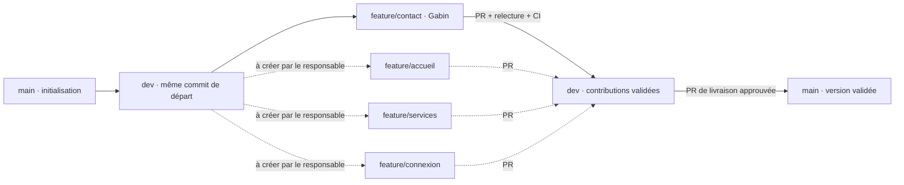
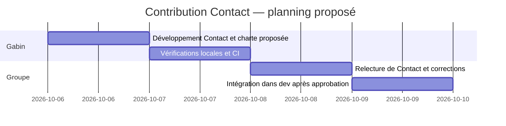

# Contribution Contact — Gabin LESCOAT

## Périmètre

Cette contribution réalise uniquement `contact.html`. Le CSS commun proposé, le favicon, le serveur d'aperçu et les outils de vérification constituent le minimum nécessaire à son intégration et à sa relecture. `index.html`, `services.html` et `connexion.html` restent aux autres membres ; aucune page factice n'est créée à leur place.

L'activité fictive choisie est l'accompagnement des entreprises : organisation, outils numériques et vie des équipes. Le groupe peut adapter les contenus des autres pages. La charte proposée associe vert profond, crème et vert clair, avec une police système et sans ressources externes.

## Utilisation

```sh
npm ci
npm run check
npm start
```

Ouvrir <http://127.0.0.1:4173/contact.html>. Sous PowerShell, employer `npm.cmd` si la politique locale bloque `npm.ps1`.

Pour les tests navigateur :

```sh
npx playwright install chromium
npm run test:e2e
```

Les captures sont générées dans `artifacts/`, exclu de Git. Les coordonnées et essais sont fictifs. Le formulaire ne réalise aucune requête et ne conserve aucune donnée.

## Contrat d'intégration

- Réutiliser `style.css`, les variables `:root`, `.container`, le header et le footer pour une identité cohérente.
- Les règles propres à Contact commencent par `.page-contact`. Chaque autre page doit isoler ses règles spécifiques de la même manière.
- Charger `assets/contact.js` uniquement sur Contact.
- Conserver les noms de fichiers attendus, les libellés du menu et adapter `aria-current="page"` sur chaque page.
- Les trois liens vers les pages des autres membres pointent vers les noms convenus. Leur cible n'existe pas encore dans cette contribution : leur test complet reste à faire dans `dev`.
- La commande `html-validate "*.html"` valide toutes les pages HTML à la racine ; elle ne se limite pas à `index.html` ou `contact.html`.

## Schéma 1 — Avant développement



**Validation du schéma par le groupe : en attente.** Les branches en pointillé sont proposées, pas réalisées. Aucun conflit ni aucune approbation n'est inventé. Le schéma 2 et le conflit dans `index.html` relèvent de l'exercice collectif à réaliser ensuite.

Repères réels : `main` et `dev` commencent au commit `2004ff3`. `feature/contact` part de cette version de `dev`, avec la contribution initiale `15a87fb`. La [PR #2](https://github.com/gabinlsc/sdvb3/pull/2) vise `dev` et référence l'[Issue #1](https://github.com/gabinlsc/sdvb3/issues/1). Aucune fusion de Contact n'a encore eu lieu.

## Planning proposé, à confirmer

L'échéance client n'a pas encore été communiquée. Les dates ci-dessous sont une proposition de travail, à ajuster par le groupe avant validation du milestone.



## Kanban de la contribution

| Tâche | État attendu après publication de la PR |
| --- | --- |
| Développer et vérifier Contact | À relire |
| Relecture par un autre membre | À faire |
| Correction demandée puis approuvée | À faire |
| Intégration à `dev` | À faire, dépend de la relecture et de la CI |
| Relecture par Gabin d'une contribution d'un autre membre | À faire, dépend d'une PR du groupe |

La colonne « Terminé » n'est atteinte qu'après approbation et fusion. Ce tableau est un suivi versionné de la contribution, pas un GitHub Project partagé. Le Kanban du groupe reste à organiser ensemble.

L'Issue et la PR Contact portent aussi le label `statut: à relire`. Le [milestone Version 1.0](https://github.com/gabinlsc/sdvb3/milestone/1) existe avec un objectif ; sa date reste à confirmer. La relecture est demandée à @Remi-tec sur la PR.

## Références des outils

- [Configuration du validateur HTML](https://html-validate.org/usage/index.html)
- [Installation et contrôles NPM avec GitHub Actions](https://docs.github.com/en/actions/tutorials/build-and-test-code/nodejs)

Le déploiement, les autres Issues et la validation collective complète sont hors de cette contribution Contact et restent à répartir dans le groupe.
